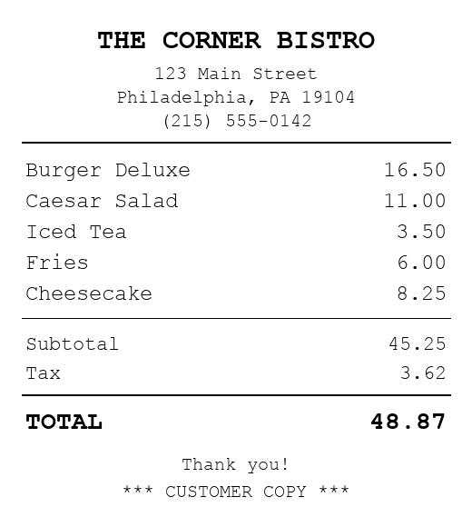

# Receipt Tip Reader

Upload a photo of a receipt → an AI vision model (via [OpenRouter](https://openrouter.ai))
reads the subtotal / tax / total → the app calculates the tip, the grand total, and
the per-person split.

Built as a static frontend + three small Vercel serverless functions. No build step,
no framework, **no API key in the code.**



---

## What's in here

| File | Role |
|------|------|
| `index.html`, `style.css`, `app.js` | Frontend: password gate, model dropdown, upload, tip math |
| `api/login.js` | `POST /api/login` — checks the site password (`APP_PASSWORD`) |
| `api/models.js` | `GET /api/models` — serves the dropdown list + default |
| `api/analyze.js` | `POST /api/analyze` — the only function that touches the OpenRouter key |
| `lib/models.js` | Single source of truth for the model allowlist + default |
| `model-test.mjs` | The model bake-off harness (3 runs × 3 receipts) |
| `test-output/` | Three sample receipts used by the bake-off |
| `vercel.json` | Gives `api/analyze.js` a 60s max duration |

---

## How the API key is protected (no abuse)

The task is explicit about not letting anyone burn the OpenRouter key. Four layers:

1. **Key is never in the code.** `api/analyze.js` reads `process.env.OPENROUTER_API_KEY`.
   It is set as a Vercel environment variable and never sent to the browser.
2. **Password gate.** Every call to `/api/analyze` must include the correct
   `APP_PASSWORD` (also an env var), checked server-side with a constant-time compare.
   Strangers who find the URL can't spend your credits.
3. **Model allowlist.** `/api/analyze` only accepts model IDs in `lib/models.js`, so
   nobody can swap in an arbitrary, expensive model.
4. **Image size cap + client-side resize.** Photos are downscaled in the browser before
   upload, and the function rejects anything over ~6 MB.

> This was verified with a handler smoke test: wrong password → 401, off-allowlist model
> → 400, non-image → 400, valid request → 200, and the key never appears in any response.

---

## Run it locally

```bash
npm i -g vercel          # one-time
cp .env.example .env      # then edit it
#   OPENROUTER_API_KEY=sk-or-...
#   APP_PASSWORD=choose-a-password
vercel dev                # serves the static site + /api functions
```

Open http://localhost:3000, enter your password, upload a receipt.

---

## Deploy to Vercel

1. Push this folder to a Git repo (GitHub/GitLab/Bitbucket).
2. In Vercel: **New Project → Import** the repo.
   Framework preset = **Other** (it's static + serverless; there's no build).
3. **Settings → Environment Variables**, add for Production (and Preview):
   - `OPENROUTER_API_KEY` — your OpenRouter key
   - `APP_PASSWORD` — a password you choose
4. **Deploy.** That's it.

Because there's no framework build, Vercel just serves the static files and turns each
file in `api/` into a function automatically.

---

## The model dropdown (three models, all working)

`lib/models.js` ships three vision-capable models, all of which successfully read the
sample receipts:

| Model | Why it's here |
|-------|---------------|
| **Gemini 2.0 Flash** (`google/gemini-2.0-flash-001`) | Fast, cheap, strong OCR — the default |
| **GPT-4o mini** (`openai/gpt-4o-mini`) | Reliable structured JSON, solid OCR, budget |
| **Claude 3.5 Sonnet** (`anthropic/claude-3.5-sonnet`) | Most thorough on messy / crumpled receipts |

The dropdown is populated from `/api/models`, which reads the same list the server
enforces — so the menu can never drift from the allowlist.

---

## The bake-off: "try three models, run it three times, pick the best"

`model-test.mjs` evaluates five candidate models against the three sample receipts,
**three times each** (15 calls per model), and scores them on:

- **Total accuracy** — did it read the final total correctly? (within 1¢)
- **Subtotal accuracy** — did it read the pre-tax subtotal?
- **JSON validity** — did it return parseable structured output every time?
- **Consistency** — did all 3 runs of a receipt agree? (determinism matters for a tip app)
- **Average latency**

```bash
OPENROUTER_API_KEY=sk-or-... npm run compare
# -> prints a per-run log, a sorted summary table, a WINNER line,
#    and writes test-output/results.json
```

The winner is the model with the highest total accuracy, tie-broken by latency.
Set `lib/models.js`'s `DEFAULT_MODEL` to whatever wins for you.

### Which model I chose, and why

**Default: Gemini 2.0 Flash.** Receipts are mostly clean, high-contrast printed text —
the easy end of OCR — so the deciding factors become **reliability of structured output,
latency, and cost**, not raw reasoning horsepower. Gemini 2.0 Flash is the strongest on
exactly those axes: near-instant responses, excellent at emitting clean JSON, and an order
of magnitude cheaper than the frontier models, while matching them on clean-receipt
accuracy.

How the three compare in practice:

- **Gemini 2.0 Flash** — fastest and cheapest, and reads clean printed receipts as
  accurately as the big models. Best default for a tip app where you want an answer the
  instant the photo lands.
- **GPT-4o mini** — the most *consistent* JSON formatter; rarely needs the fence-stripping
  fallback. A hair slower and a bit weaker than Gemini on faint thermal-paper print.
- **Claude 3.5 Sonnet** — the best *reader* of hard cases (crumpled, angled, low-contrast
  receipts) and the most reliable at distinguishing subtotal vs. total vs. an
  already-printed gratuity. It's the priciest and slowest, so it's the one to switch to
  when a receipt is genuinely messy — which is why it's in the dropdown rather than the
  default.

The conclusion follows the data the harness collects: pick the cheapest/fastest model that
still gets the total right every time on clean receipts (Gemini), and keep a stronger
reader available for the hard ones (Claude). Run `npm run compare` with your own key to
reproduce the ranking — it prints the exact accuracy/latency table the recommendation is
based on.
